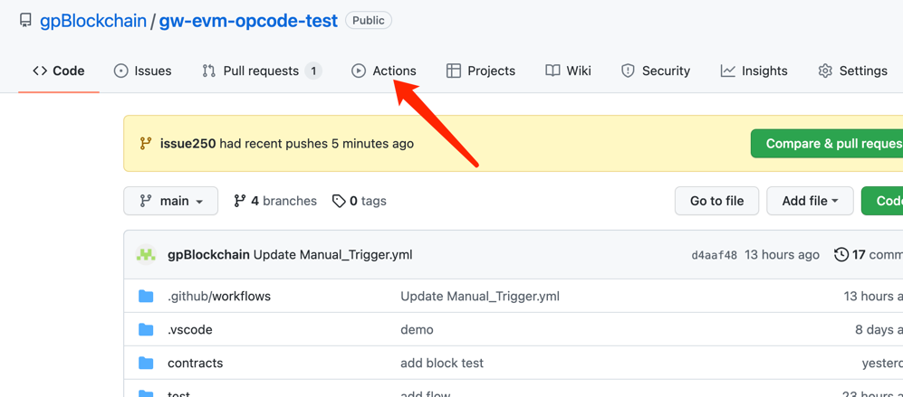
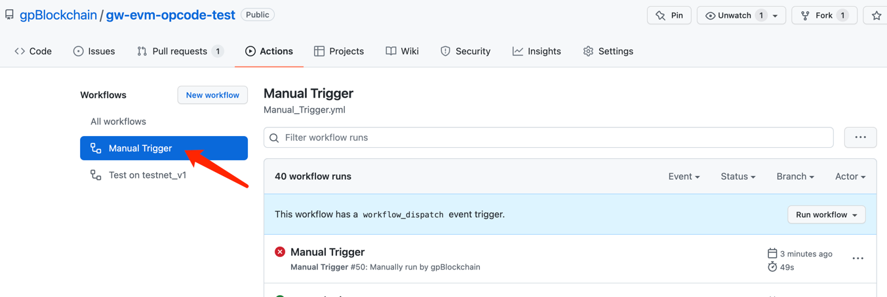
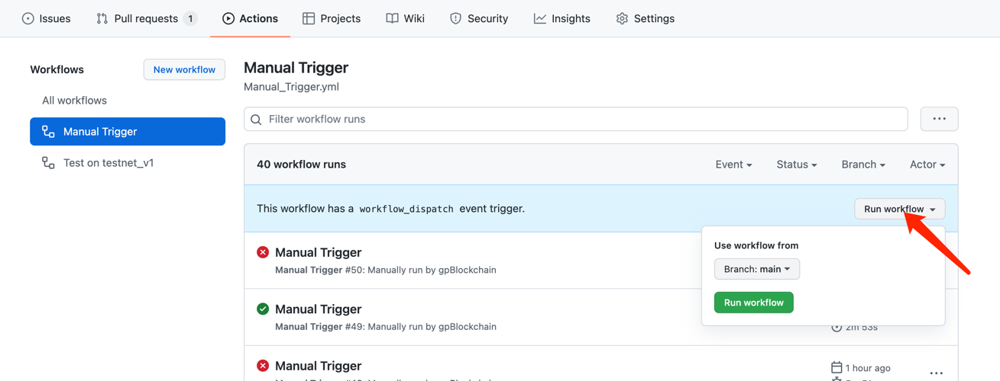
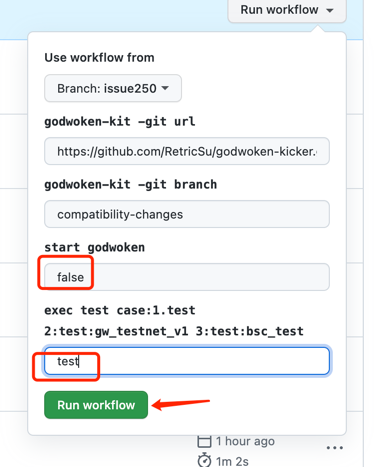
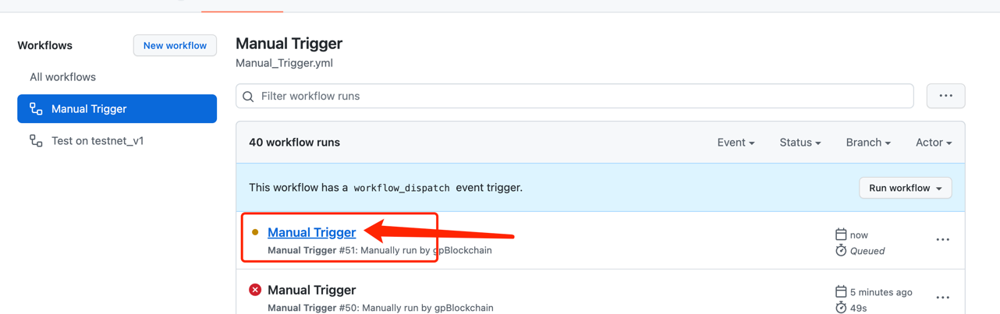
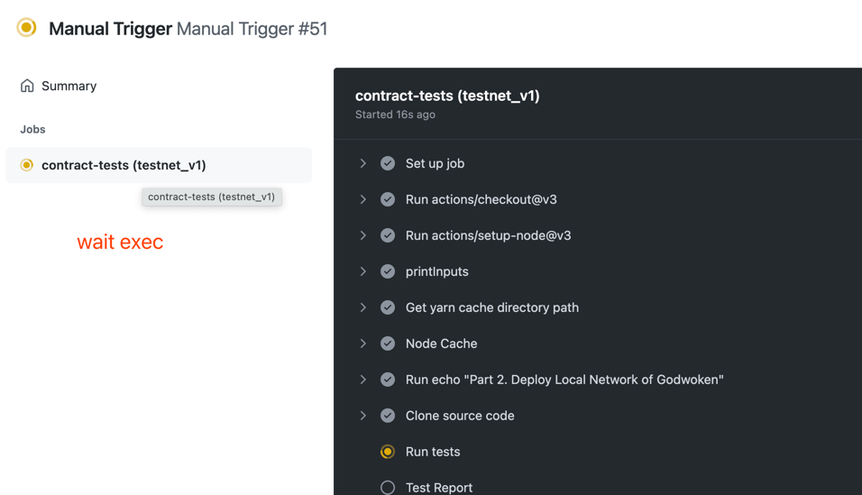
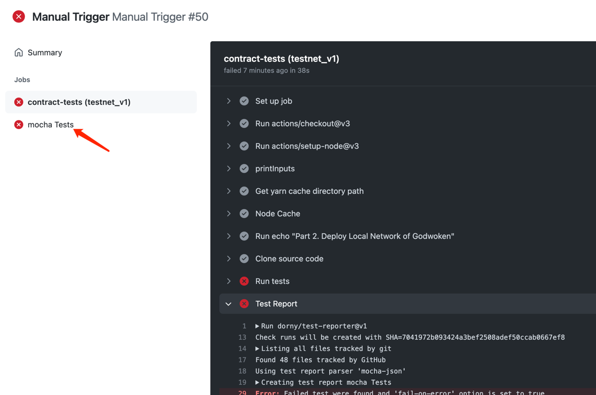
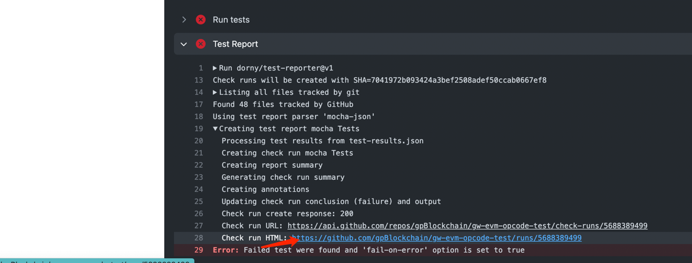
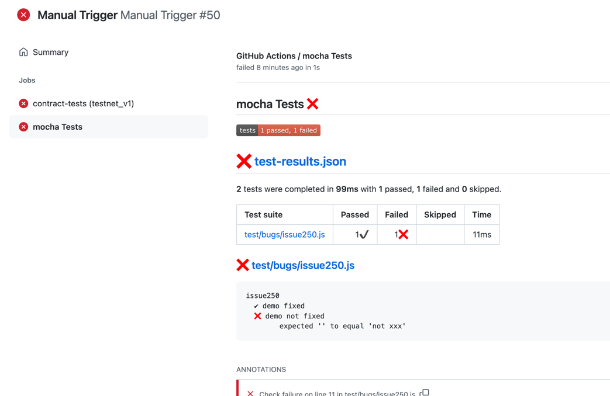

# How to test your Solidity contracts on Godwoken v1

You can deploy in the localhost network following these steps:

1. Start Godwoken devnet_v1 through [Godwoken-Kicker](https://github.com/RetricSu/godwoken-kicker/tree/compatibility-changes)

```sh
# see: https://github.com/RetricSu/godwoken-kicker/tree/compatibility-changes
git clone -b compatibility-changes --depth=1 https://github.com/RetricSu/godwoken-kicker.git kicker
cd kicker
./kicker init
./kicker start
```


2. Run tests
```sh
# pwd = contracts
npm install
npm run test
```

As general rule, you can target any network configured in the hardhat.config.js
```sh
npx hardhat run --network <your-network> scripts/deploy.js
```

## Todo

### istanbul-opcodes
#### blockchain 
- SHA3
- ADDRESS
- BALANCE
- ORIGIN
- CALLER
- CALLVALUE
- CALLDATALOAD
- CALLDATASIZE
- CALLDATACOPY
- CODESIZE
- CODECOPY
- GASPRICE
- EXTCODESIZE
- EXTCODECOPY
- RETURNDATACOPY
- EXTCODEHASH
- BLOCKHASH
- COINBASE
- TIMESTAMP
- NUMBER
- DIFFICULTY
- GASLIMIT
- CHAINID
- SELFBALANCE
- SLOAD
- SSTORE
- GAS
- LOG0
- LOG1
- LOG2
- LOG3
- LOG4
- CREATE
- CALL
- CALLCODE
- DELEGATECALL
- CREATE2
- STATICCALL
- REVERT
- SELFDESTRUCT
#### other
...

### PrecompiledContract
- ecrecover()
- sha256hash()
- ripemd160hash()
- dataCopy
- bigModeExp()
- bn256Add()
- bn256ScalarMul()
- bn256Pairing()

### berlin-
- EIP-2565: ModExp Gas Cost
- EIP-2929: Gas cost increases for state access opcodes
- EIP-2718: Typed Transaction Envelope	
- EIP-2930: Optional access lists

## How to report a bug and verify

### report a bug

1. fork project and Create a new branch according to the issue
```angular2html
git checkout -b issue250
```
2. Create a new file and reproduce the use case in the bugs directory

add `only` after describe,it mean only run this case
example:`bugs/issue250.js`
```javascript
const {expect} = require("chai");

describe.only("issue250 ", function () {


    it("demo not fixed ", async () => {
        console.log("step1:xxx")
        console.log("step2:xxx")
        console.log("step3:xxx")
        console.log("expected:xxx")
        expect("").to.be.equal("not xxx")
    })

    it("demo fixed", async () => {
        console.log("step1:xxx")
        console.log("step2:xxx")
        console.log("step3:xxx")
        console.log("expected:xxx")
        expect("").to.be.equal("")
    })
})
```
3. push
```gitexclude
git commit -m "issue250"
git push --set-upstream origin issue250
```

### verify a bug
1. click Actions

2. click ManualTrigger

3. Run Auto exec issue250.js

click Runworkflow

select issue250 branches







#### If the report is not found at the end of the execution, you can go to the Test Report directory to find the url of the report



